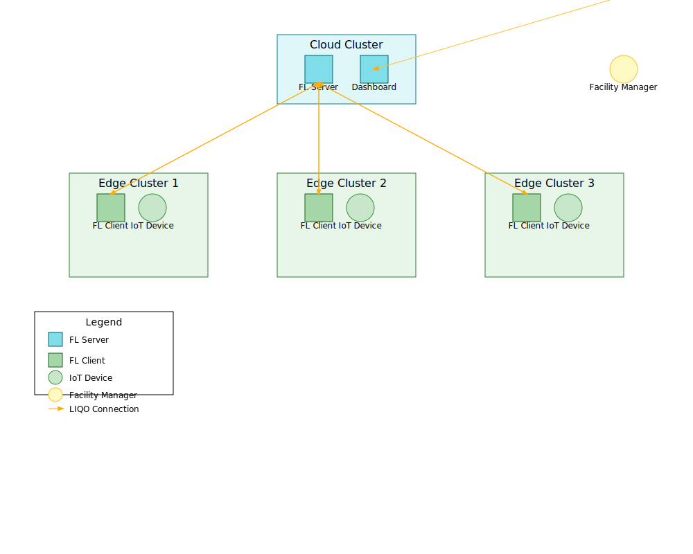

Fusion Check
======

Fusion Check proposal for Use Case Grant aims to develop an interoperable set of software components for FLUIDOS and deploy a dashboard interface aimed at facility managers that need to optimize communication between IoT devices, edge servers and the cloud in sensitive infrastructure such as EV Charging station hubs, parking lots and corporate offices with access control IoT devices. 

## References

- [https://github.com/fluidos-project](https://github.com/fluidos-project)
- [https://docs.liqo.io/en/v1.0.0-rc.1/](https://docs.liqo.io/en/v1.0.0-rc.1/)